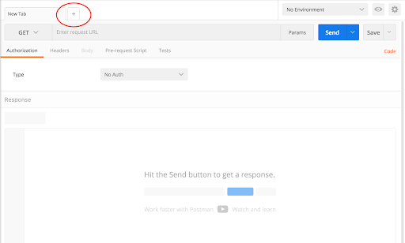

.. _api_create_vm:

----------------------
API: Create VM
----------------------

Overview
++++++++

In the following exercise, you will create a VM using Nutanix v3 APIs.

  Estimated time to complete: **30 MINUTES**

Words there

Lab Setup
+++++++++
Exercise 1: Create your own VM
++++++++++++++++++++
1. Click + in the main window to create a new tab-window

2. Click the dropdown and select POST
v3 is RESTful and uses standard HTTP verbs like GET, POST, PUT, DELETE

3. Enter the URL to create a VM
https://{{prism_central_ip}}:9440/api/nutanix/v3/vms
Replace {{prism_central_ip}} with the IP address displayed in the lab handout.
v3 exposes semantic URLs to make understanding and using the API easy

4. Configure basic authentication for this API call
Click the Authorization tab and select Basic Auth from the Type dropdown
Enter Prism credentials of the cluster :
Username : admin / Password : Use the “Prism login password” from handout
Check “Save helper data to request”
Click Update Request to set authorization in the request header

5. Set the media type to application/json
Click the Body tab
Select the radio button for raw
Click the Text dropdown and select JSON (application/json)
Click the Headers tab and confirm the headers

6. Fill out the body
Copy or type the following JSON as the VM intent input

.. code-block:: bash

  {
      "spec": {
          "name": "API-VM-{Initial}",
          "resources": {
              "num_vcpus_per_socket": 1,
              "num_sockets": 1,
              "memory_size_mib": 1024,
              "power_state": "OFF"
          }
      },
      "api_version": "3.0",
      "metadata": {
          "kind": "vm"
      }
  }

Takeaways
+++++++++
