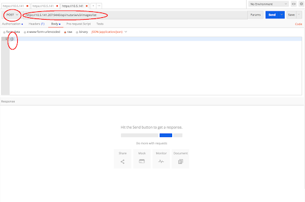

.. _api_image_list:

----------------------
API: List of Images
----------------------

Overview
++++++++

.. note::

  Estimated time to complete: **30 MINUTES**

Words there

Lab Setup
+++++++++
Exercise 3: List the images on the cluster
++++++++++++++++++++
1. Click + in the main window to create a new tab-window
2. Click the dropdown and select POST
 - v3 standardizes on POST for listing to offer server-side filtering, grouping, and sorting
3. Enter the URL to list images
 - https://{{prism_central_ip}}:9440/api/nutanix/v3/images/list
 - Replace {{prism_central_ip}} with the IP address mentioned in the lab handout

4. Configure basic authentication for this API call
 - Follow the same steps from the first exercise
 - v3 conforms to HTTP as a stateless protocol such that each API call is authenticated
5. Set the media type to application/json
 - Follow the same steps 5 from the first exercise
6. Fill out the body
 - Click the Body tab
 - Copy or type an empty dictionary in the json body

.. code-block:: bash

  {}

Takeaways
+++++++++
